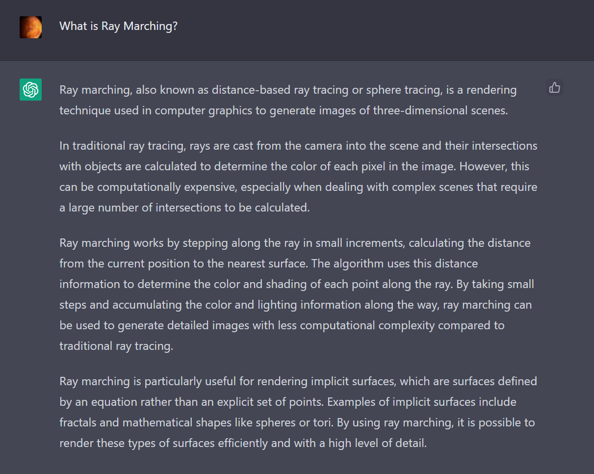

# Volumetric Rendering

Download the scene here: <a href = https://github.com/FzComet206/Volumetirc-Rendering/releases/download/VolumeRender/Volume.Relesase.zip > Volumetric Rendering </a>
---

https://user-images.githubusercontent.com/24278214/216487840-55d112b2-dcc6-4319-a852-b059c86c2a53.mp4

---

## Motivations

In comptuer graphics, there are an abundant methods that are related to generate a 2D image from a 3d Space. For example, rasterization, which requires a render pipeline and all sort of math/codes. Since i use Unity Engine for most of my projects, i don't have to worry too much about modifying or even write my own render pipelies. Of course there are benefits in doing so, such as more customization, better performance, or for the sake of learning, but is it worth the time? It depends. 

I've always wanted to consider performance in my projects, even though i'm not even good at optimizing. I feel like using Unity Engine might have some performace bottlenecks since it's a large engine. If i want to make a fluid simulation or a N-Body simulation, i might be able to skip some of the bottlenecks by developing my own render pipeline. With that in mind, i tried learning Vulkan API by following a youtube toturial series. After serveral days of coding with C++ just to get a window open and basic pipeline working, i come into a realization that it might not be worth it considering time and my sanity. In fact, even if i was able to write my own minimal 3D engine with the Vulkan API, i might just end up re-inventing the wheel, while ignoring the optimizations that Unity Engine had in their pipelines.

I have done two procedural based projects before and wrote a blog for each of them, but i've always wanted to do a graphic or simulation related one. Unity has a lot of things built in, and if i use High Definition Render Pipeline and make a scene with out-of-box styles, it seems to me that i'll skip the most intersting part in graphic programming. But i also don't want to go through Vulkan API and make everything myself, as that is unrealistic for a person without industry experience. That's why i stumbled upon a concept called volumetric rendering. When generating a 2D image from a 3D space, the engine usually renders triangles, which can either be opaque or transparant. This method of rendering usually saves performance, but lacks capacity in rendering objects that have a volume, such as cloud or smoke. Ray Marching, a method for volumetric render, does exactly that.

---

## What is Ray Marching?

So how does Ray Marching works? I have recently played with ChatGPT and feel like it can give a general answer.

---

## Ray sphere intersection

Before we get into the method. I first have to define a volume. In this project, i used a sphere. Data inside the sphere are being rendered, while the others are ignored.

---
## Ray Marching.

In this project, i used a 3D texture to store Simplex noise values. The noise was modified using fractals, domain wrapping, and scrolling. This noise is later sampled using Unity's built in texture trilinear sampling, so the result isn't pixalated.

In general, the Ray Marching work as follows:

- Calculate the distance between Point A and Point B from the Ray Sphere intersection function. 

- Define a ratio of steps/distance, for example 40 steps/ 100 distance (wordspace coordinate). 

- Calculate the number of steps and step size in between Point A and Point B.

- For each steps, starting from point A, increment the position by ray direction * stepsize. Sample density value at each step. If the density is larger than zero, run the LightMarch function and calculate other lighting parameters.

code snippets march toward density field

code snippets march towerd light

## Calculate Transparency and Beer's Law

## Blending Colors. 

## Additional Notes 
